# 🛒 QuickPOS Lite

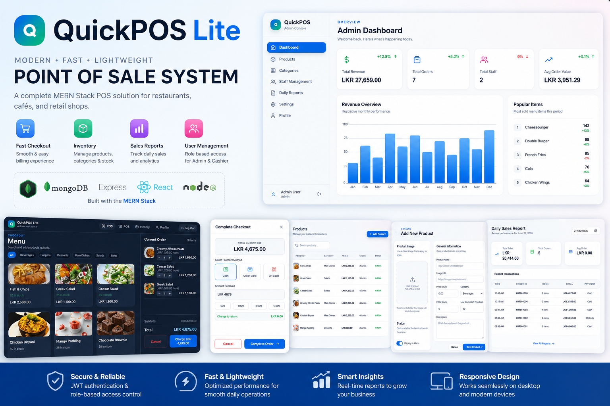

QuickPOS Lite is a modern, fast, and light-weight single-branch **Point of Sale (POS)** system designed for restaurants, cafés, and retail shops. Built on the robust **MERN Stack** (MongoDB, Express, React, Node.js), it provides an efficient, clean user experience for cashiers to process bills and admins to manage inventory, users, and daily sales reports.

---

## 🏗️ System Architecture

QuickPOS Lite follows a clean client-server architecture with secure API communication:

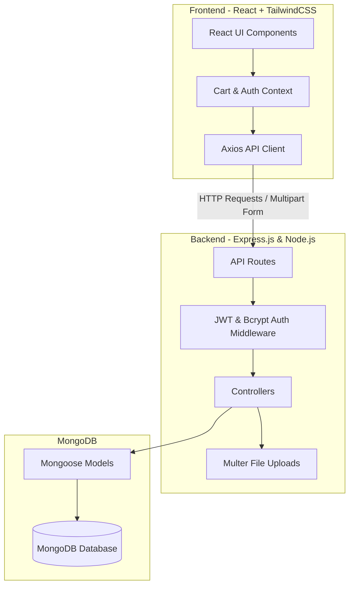

### Key Technical Specs:
* **Frontend:** React (Vite), TailwindCSS, React Router, Lucide Icons.
* **Backend:** Node.js, Express, JWT Authentication, Multer (Local Storage uploads).
* **Database:** MongoDB with Mongoose ODM.

---

## ✨ Features

### 👤 User Roles & Authentication
* **Role-Based Access Control (RBAC):** Admin and Cashier roles.
* **Secure JWT Login:** Password hashing via Bcrypt.
* **User Profiles:** Customize profile pictures, name, and email details.

### 💻 Cashier Workspace (POS)
* **Real-time Product Grid:** Filter by categories and search instantly.
* **Interactive Cart:** Easily increment/decrement quantities and remove items.
* **Opaque Checkout Modal:** Simple payment method selection (Cash, Card, QR) with quick-cash change calculation.
* **Print-Ready Receipts:** Instant receipt window for thermal printers or saving as PDF.

### 🛡️ Admin Dashboard
* **Sales Analytics:** Daily reports, metrics, and low-stock indicators.
* **Product Catalog Management:** Add, edit, or remove items, assign categories, and upload food images.
* **Category Management:** Manage categorization to streamline the checkout process.
* **User Management:** Create new system users and toggle active/inactive status.

---

## 📸 Screenshots

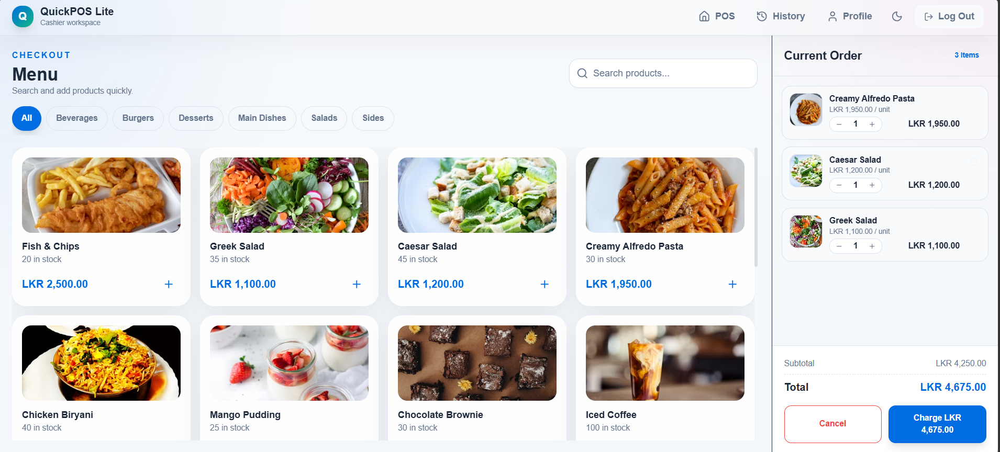
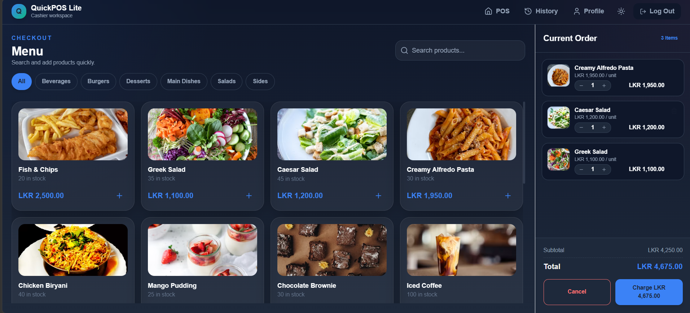
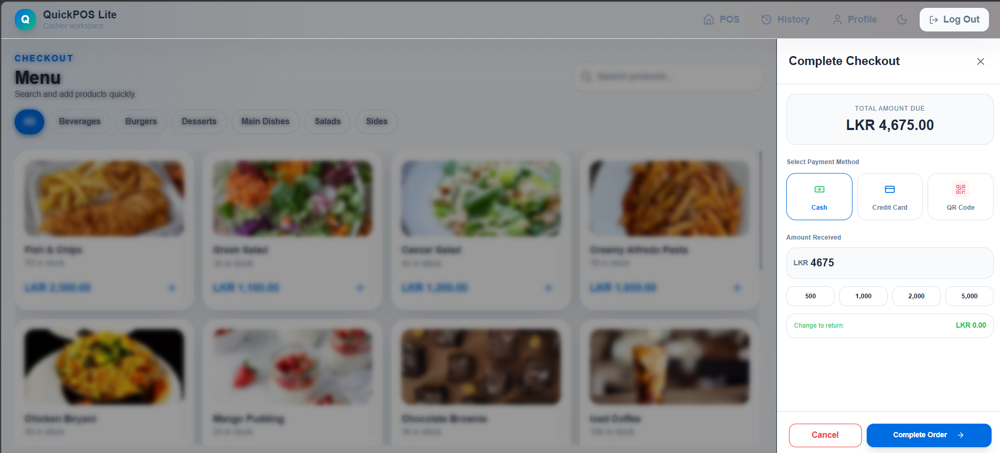
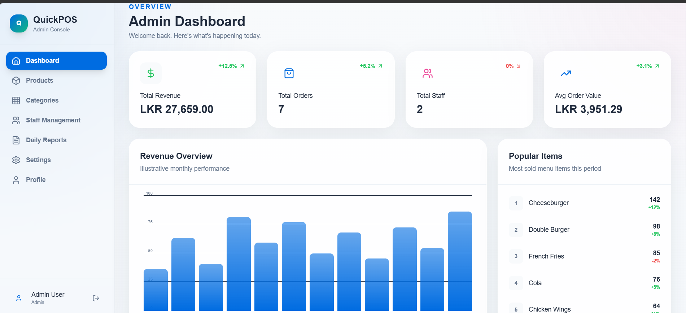
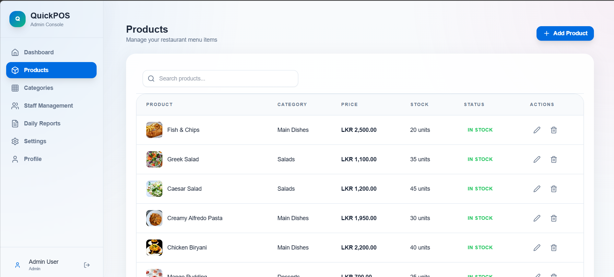
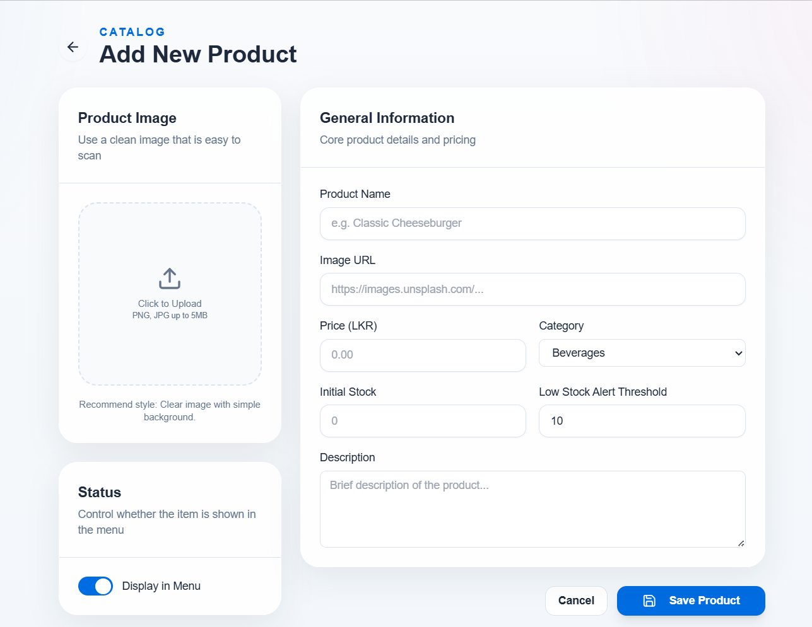
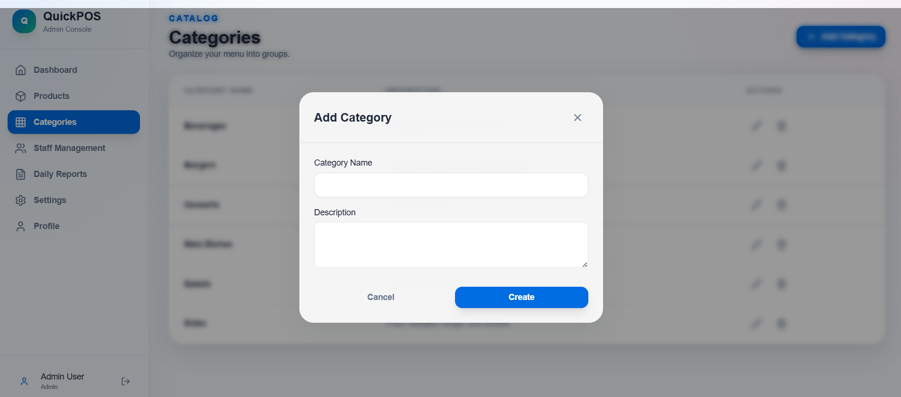
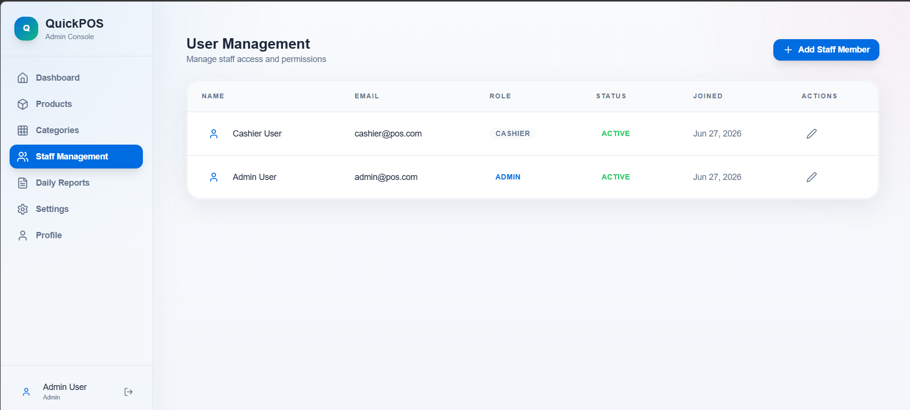
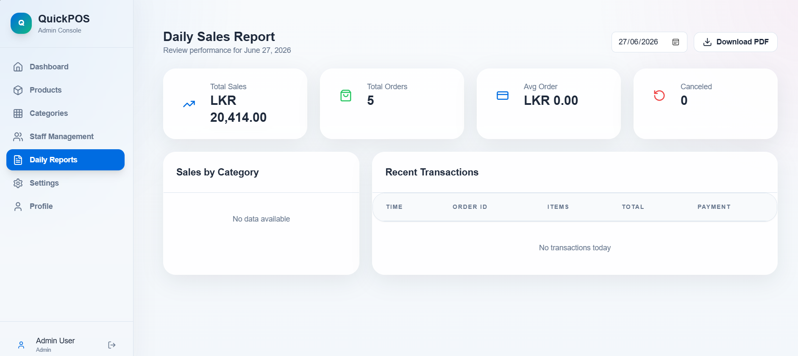
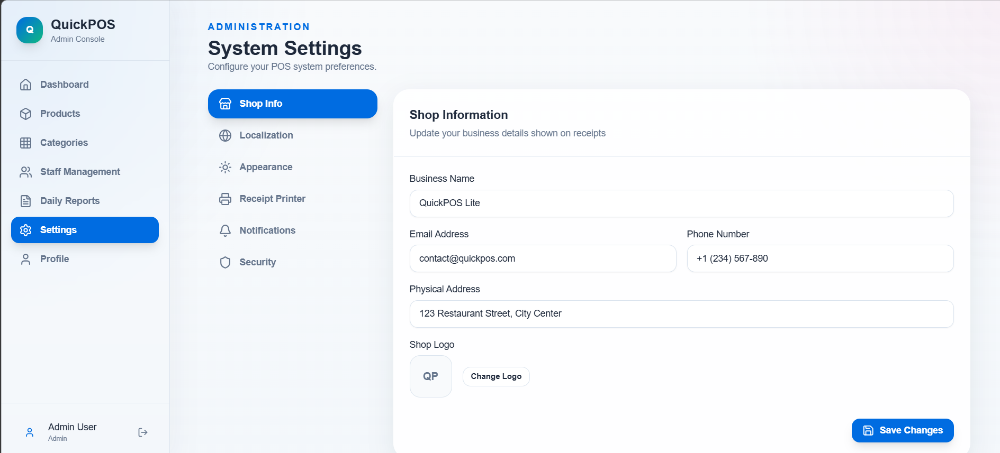
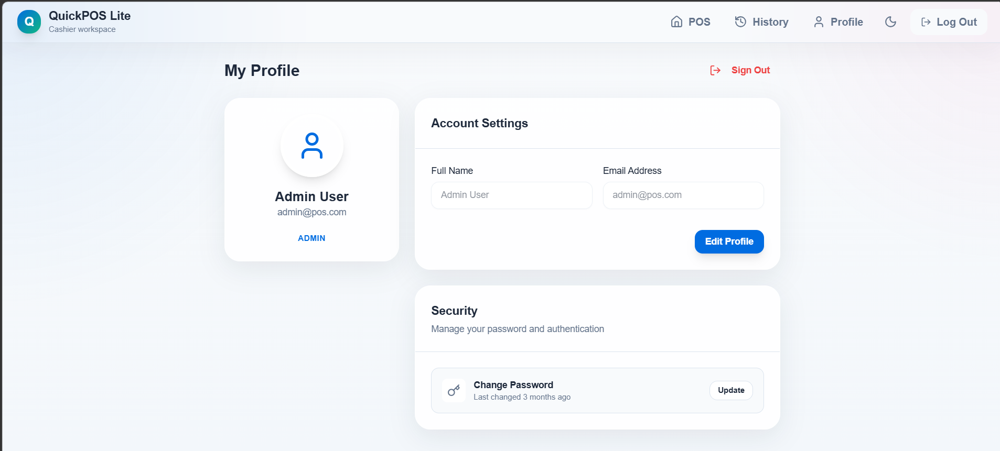
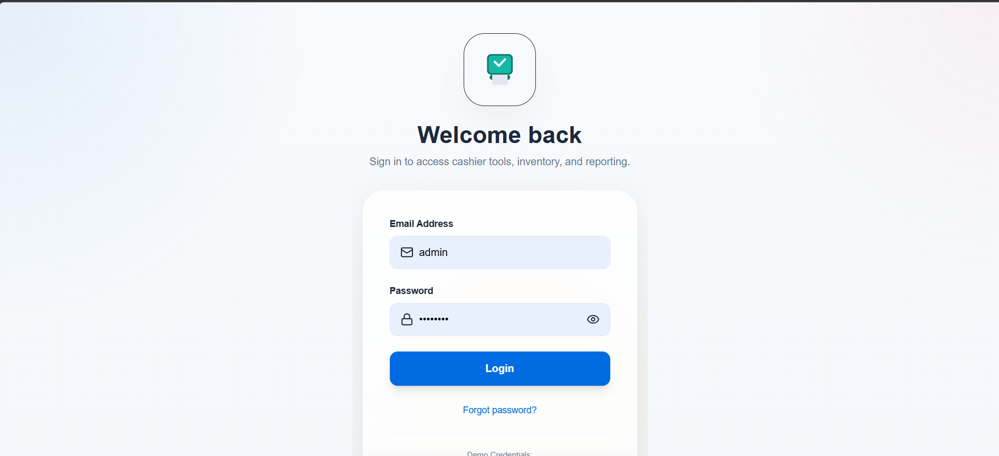

---

## 🚀 Setup & Installation

### Prerequisites
* Node.js (v18 or higher)
* MongoDB Local or Atlas URI

### 1. Clone & Clean Install
Clone the repository and install dependencies for both the frontend and backend.

#### Backend Setup
```bash
cd backend
npm install
```

Configure environment variables in `backend/.env`:
```env
PORT=5000
MONGO_URI=mongodb://localhost:27017/quickpos
JWT_SECRET=your_jwt_secret_key_here
NODE_ENV=development
```

Seed the database with sample products and users:
```bash
npm run data:import
```

Start the backend server:
```bash
npm run dev
```

#### Frontend Setup
```bash
cd ../frontend
npm install
```

Configure environment variables in `frontend/.env`:
```env
VITE_API_URL=http://localhost:5000/api
```

Start the frontend development server:
```bash
npm run dev
```

---

## 🛠️ Folder Structure

```text
├── backend/
│   ├── src/
│   │   ├── config/          # DB connection configurations
│   │   ├── controllers/     # Route logic handlers
│   │   ├── middleware/      # JWT protection & multer uploads
│   │   ├── models/          # Mongoose database schemas
│   │   ├── routes/          # API route definitions
│   │   └── utils/           # Data seeders
│   └── uploads/             # Locally uploaded product & profile images
│
├── frontend/
│   ├── src/
│   │   ├── api/             # Axios configurations
│   │   ├── components/      # Reusable POS components & UI
│   │   ├── context/         # Auth and Cart global state
│   │   ├── pages/           # Admin pages, Cashier pages, Profile
│   │   └── utils/           # Number & currency formatting
│
└── UI images/               # Application screenshots
```

---

## 📄 License
This project is licensed under the MIT License.
